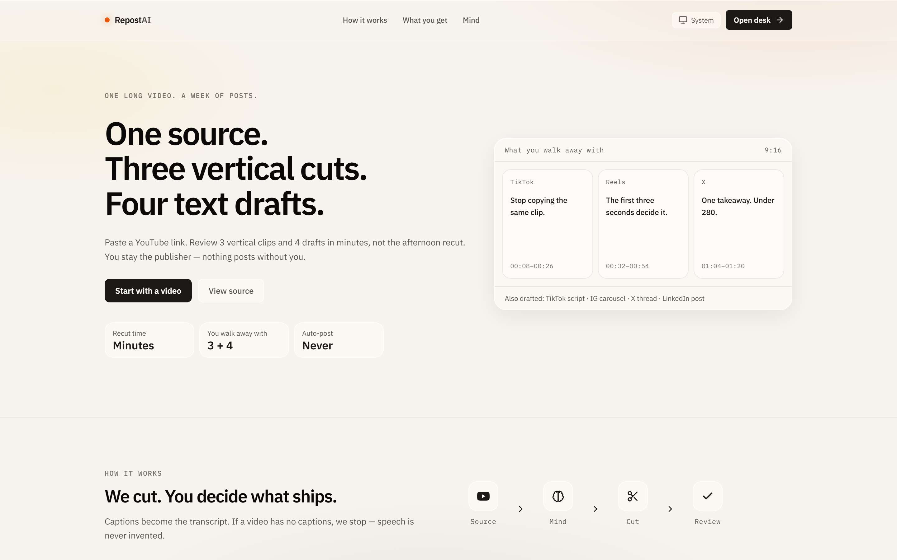
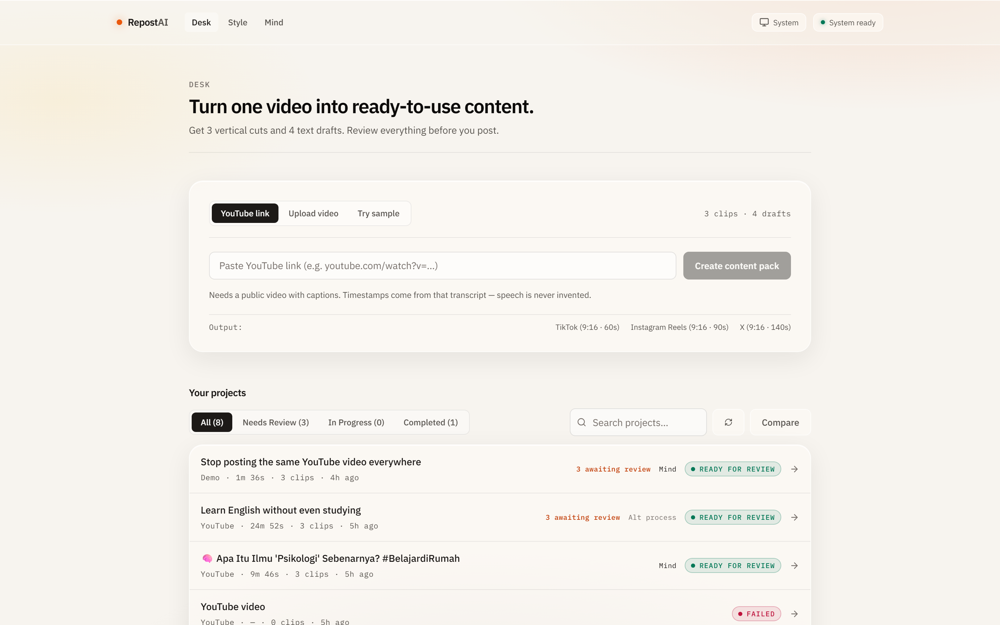
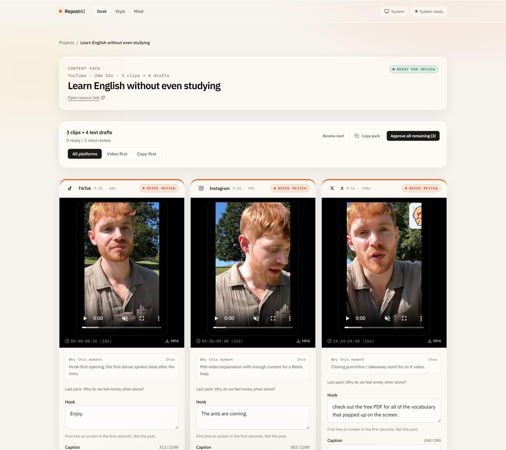
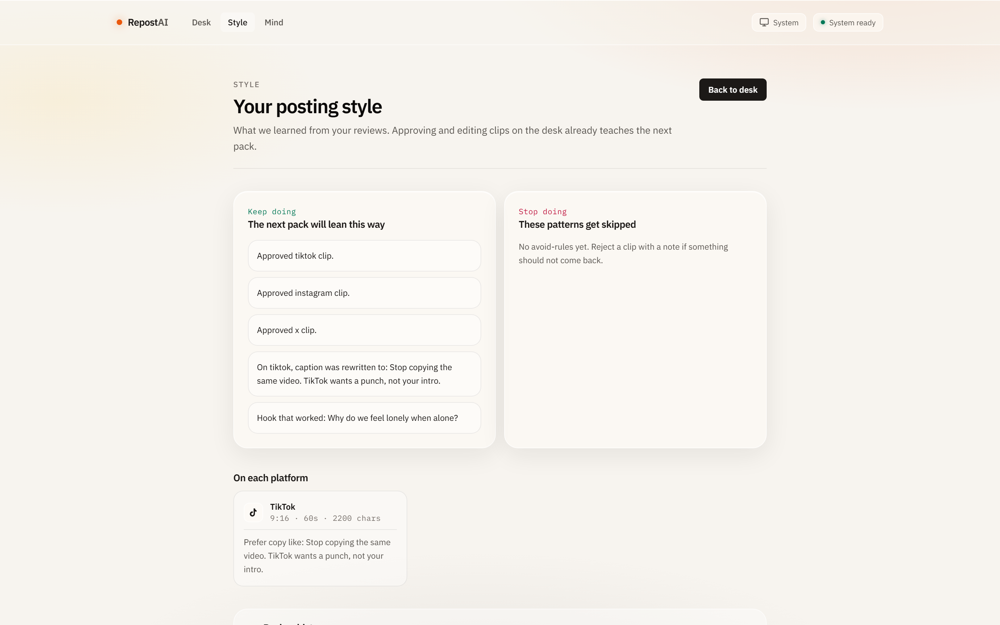
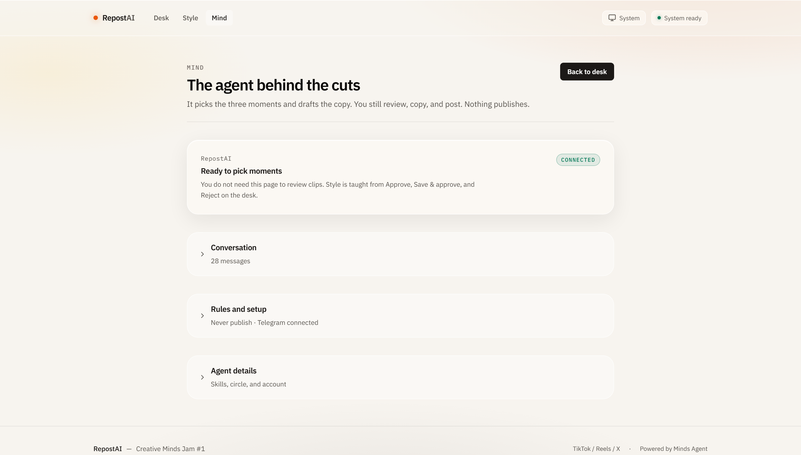

# RepostAI

**One source. Three vertical cuts. Four text drafts. You review. Nothing publishes.**

RepostAI turns a YouTube video into a **content pack**: TikTok, Reels, and X clips plus a script, carousel, thread, and LinkedIn draft. A persistent [Minds](https://hellominds.ai) agent picks the moments. You approve, rewrite, or skip. Those decisions steer the next pack.

Built for [Creative Minds Jam #1](https://creativemindsjam.com/), track **Content Repurposing Across Platforms**.

> Built with [Minds by Animoca Brands](https://hellominds.ai).

<p align="center">
  
</p>

---

## What you walk away with

Paste a public YouTube link (captions required). Review in minutes, not the afternoon recut.

| Output | What it is |
|---|---|
| 3 vertical clips | 9:16 cuts for TikTok, Instagram Reels, and X |
| 4 text drafts | TikTok script, IG carousel, X thread, LinkedIn post |
| Your call | Approve, Save & approve, or Reject — then **Copy pack** |

Nothing posts. MP4s download one at a time.

---

## How a creator uses it

```
Pick a source  →  Wait  →  Review what is left  →  Take the pack
```

1. **Start** on `/desk` — YouTube link, upload + optional caption URL, or the labeled **Demo data** sample.
2. **Wait** — reading source, finding moments, preparing clips. The page updates by itself.
3. **Review** — sticky bar shows `ready / need review`. Edited clips count as **Ready**.
4. **Take** — **Copy pack** copies ready clips plus all four drafts. Download each MP4 separately.

Optional: **Style** (`/voice`) is keep/stop rules from those reviews. **Mind** (`/mind`) is the agent status. You do not need either page to finish a pack.

**Start** on the desk — paste a YouTube link, upload, or try the sample.

<p align="center">
  
</p>

**Review** the pack — three 9:16 clips, hooks, captions, and Copy pack. Nothing publishes.

<p align="center">
  
</p>

---

## Why the Mind matters

Fallback recipes exist if the agent is offline — the desk labels that **Alt process**, never as Mind. On the happy path the Mind is the product: one conversation, memory, and a follow-up after every ready pack.

### Prove persistence (pack 1 → pack 2)

1. Open [`/desk`](http://localhost:3000/desk), run **Try sample** or a **public YouTube URL with captions**.
2. Reject one clip with a note (for example `skip cold intros`) and/or save a shorter caption.
3. Open **Style** — keep/stop rules. Open **Mind** → Conversation if you want the transcript.
4. Run a second pack.
5. Compare (`/jobs/compare?a=<first>&b=<second>`) for hook / caption / window diffs.

Tenets live in every propose prompt. Mirror them in the Mind's **Soul** at [hellominds.ai/profile](https://hellominds.ai/profile). On `/mind`, open **Rules and setup** to copy or send them. Link Telegram on the same profile if you want native chat with the same memory.

### Voice loop

```
Pack N: Mind proposes clips
        │
        ▼
You reject TikTok: "skip cold intros"
You rewrite an Instagram caption shorter
You approve X
        │
        ▼
Next pack injects those notes before the Mind proposes again
```

<p align="center">
  
</p>

<p align="center">
  
</p>

### Tenets

- **NEVER publish** — only propose packs for human review
- **NEVER change** the creator's core claim — adapt format and tone only
- **Prefer hook-first clips** — skip long intros unless you like them
- **Ground every timestamp** in the transcript — do not invent speech
- **Respect platform limits** — TikTok/IG ≤ 2200 chars, X ≤ 280 chars

---

## Architecture

```
pnpm dev
```

Starts two processes:

```
┌──────────────────────┐          ┌──────────────────────┐
│   Next.js Frontend   │  /api/*  │   Node.js Backend    │
│      :3000           │ ──────── │      :4000           │
│                      │  rewrite │                      │
│  Landing (/)         │          │  HTTP handlers       │
│  Desk (/desk)        │          │  Pipeline:           │
│  Content pack        │          │   YouTube → Mind →   │
│  Style / Mind        │          │   ffmpeg → clips     │
└──────────────────────┘          └──────────────────────┘
                                          │
                                          ▼
                                  ┌──────────────────┐
                                  │  Minds Platform  │
                                  │  Memory ◄── reviews
                                  └──────────────────┘
```

```
Source ──► captions / transcript
              │
              ▼
        Minds Agent  ◄── style from prior reviews
        (local fallback if the Mind is offline)
              │
              ▼
        ffmpeg cuts 9:16 files
              │
              ▼
        Ready for review → Copy pack / download MP4s
```

---

## Getting started

### Prerequisites

- Node.js 22+
- pnpm

### Install

```bash
git clone https://github.com/bagusardin25/RepostAI.git
cd RepostAI
pnpm install
```

### Configure

Copy `.env.example` to `.env.local` at the project root:

```env
FRONTEND_PORT=3000
BACKEND_PORT=4000

MINDS_BUILDER_API_KEY=your_key_here
MINDS_MIND_ID=your_mind_id
MINDS_CONVERSATION_ALIAS=main
```

Get a key from the [Minds Builder Console](https://build.hellominds.ai/console).

Without a Minds key the cutter still runs on the demo sample, but jobs are labeled **Alt process**. The real loop needs a Builder key and Mind id.

### Run

```bash
pnpm dev
```

| URL | What |
|---|---|
| [http://localhost:3000](http://localhost:3000) | Landing |
| [http://localhost:3000/desk](http://localhost:3000/desk) | Start a content pack |
| [http://localhost:3000/jobs/…](http://localhost:3000/desk) | Review and copy |
| [http://localhost:3000/voice](http://localhost:3000/voice) | Style (keep / stop) |
| [http://localhost:3000/mind](http://localhost:3000/mind) | Mind status |
| [http://localhost:3000/jobs/compare](http://localhost:3000/jobs/compare) | Compare two packs |

YouTube jobs need **captions**. Upload-only has no speech-to-text unless you also paste a captioned YouTube URL on the upload tab.

### Demo sample

On the desk, open **Try sample**. There is one **Demo data** clip: *Stop posting the same YouTube video everywhere*. It skips YouTube download, uses the built-in transcript, and writes local 9:16 files.

### Other commands

| Command | Description |
|---|---|
| `pnpm test` | Pipeline unit tests (recipes, captions, voice, watch, lineage) |
| `pnpm lint` | TypeScript check |
| `pnpm build` | Production build |
| `pnpm start` | Production frontend |

---

## Pages

### Landing (`/`)

One source → 3 clips + 4 drafts. You stay the publisher.

### Desk (`/desk`)

YouTube link, upload + optional caption URL, or the demo sample. **Your projects** lists packs. Channel watch is collapsed under **Optional: automate new uploads**.

### Content pack (`/jobs/[id]`)

Sticky review bar (`ready / need review`, Review next, Approve all remaining, Copy pack). View presets: All platforms, Video-first, Copy-first (display only — all three clips are still produced). Clip cards, four draft teasers, MP4 downloads. **How this was chosen** and the source transcript sit below.

Edited and approved clips are **Ready**. Needs-review clips are not copied without a warning.

### Compare (`/jobs/compare`)

Earlier pack left, later pack right. Hook / caption / window diffs.

### Style (`/voice`)

Keep doing / stop doing from desk reviews. History, score, and JSON export are behind details.

### Mind (`/mind`)

Connected / offline card. Conversation, rules, Telegram, and skills are behind details.

---

## API

Backend on `:4000`. The frontend proxies `/api/*`.

| Method | Path | Description |
|---|---|---|
| `GET` | `/api/health` | db, ffmpeg, minds |
| `GET` | `/api/jobs` | List packs with clip counts |
| `POST` | `/api/jobs` | Create (JSON or multipart with video) |
| `GET` | `/api/jobs/:id` | Detail, clips, drafts, lineage |
| `GET` | `/api/jobs/compare?a=&b=` | Side-by-side |
| `POST` | `/api/jobs/:id` | Retry a failed pack |
| `POST` | `/api/clips/:id/review` | `{ action, caption?, hook?, note? }` |
| `GET` | `/api/voice` | Style memory + review history |
| `GET` | `/api/mind` | Mind profile, circle, skills |
| `GET` | `/api/mind/history` | Conversation transcript |
| `POST` | `/api/mind/tenets` | Seed standing rules |
| `GET` | `/api/watch` | Channel watch config |
| `GET` | `/api/media/:kind/:file` | Source / clip MP4s (supports Range) |

### Create a pack

```bash
curl -X POST http://localhost:4000/api/jobs \
  -H "Content-Type: application/json" \
  -d '{"youtubeUrl": "https://www.youtube.com/watch?v=..."}'

curl -X POST http://localhost:4000/api/jobs \
  -H "Content-Type: application/json" \
  -d '{"fixture": true}'
```

`202` with `{ job }`. Work continues in the background.

Status: `queued → fetching_source → analyzing → clipping → ready | failed`

### Review a clip

```bash
curl -X POST http://localhost:4000/api/clips/{id}/review \
  -H "Content-Type: application/json" \
  -d '{"action": "edit", "caption": "New caption", "hook": "New hook", "note": "shorter please"}'
```

Actions: `approve`, `reject`, `edit`. Each review is stored and sent to the Mind for the next pack.

---

## Tech stack

| Layer | Technology |
|---|---|
| Frontend | Next.js 15 (App Router), TypeScript, Tailwind CSS v4 |
| Backend | Node.js (`http.createServer`), JavaScript |
| Agent | [Minds](https://hellominds.ai) via `@animocabrands/minds-client-lib` |
| Database | SQLite via `@libsql/client` |
| Video | `ffmpeg-static` (9:16) |
| YouTube | `youtubei.js` (meta, captions, download) |
| Package manager | pnpm |

---

## Repository

```
RepostAI/
├── backend/               # API (:4000)
│   ├── server.js
│   ├── http/              # Route handlers
│   ├── pipeline/          # YouTube, Minds, ffmpeg, recipes, voice
│   ├── db/                # SQLite
│   └── lib/
├── frontend/              # UI (:3000)
│   ├── app/               # /, /desk, /jobs/[id], /jobs/compare, /voice, /mind
│   ├── components/
│   ├── lib/               # API client, content-pack copy helpers
│   └── styles/
├── docs/screenshots/      # Product shots in this README
├── data/                  # Runtime (gitignored)
├── .env.example
├── package.json
└── LICENSE
```

---

## Platform limits

| Platform | Max duration | Aspect | Caption |
|---|---|---|---|
| TikTok | 60s | 9:16 | 2200 chars |
| Instagram | 90s | 9:16 | 2200 chars |
| X | 140s | 9:16 | 280 chars |

---

## License

[MIT](LICENSE)
